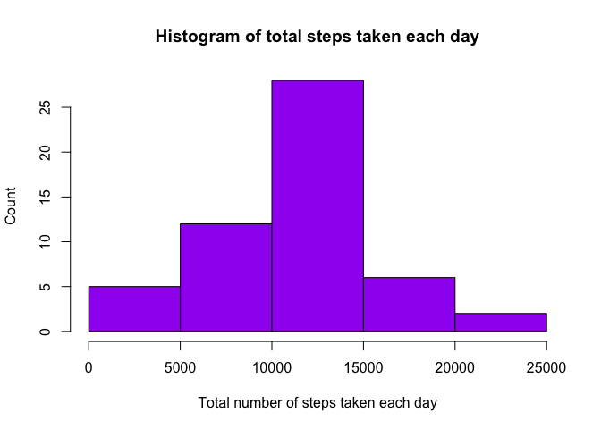
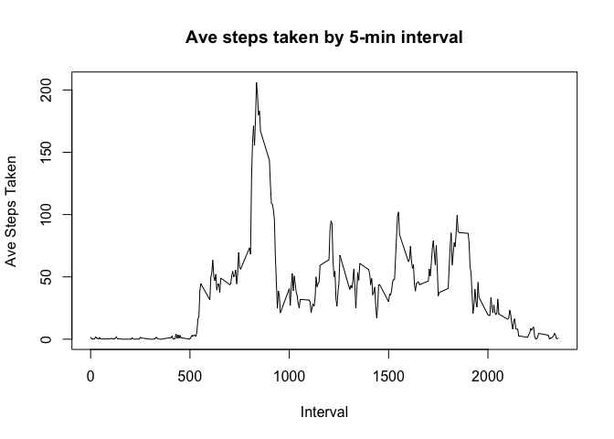
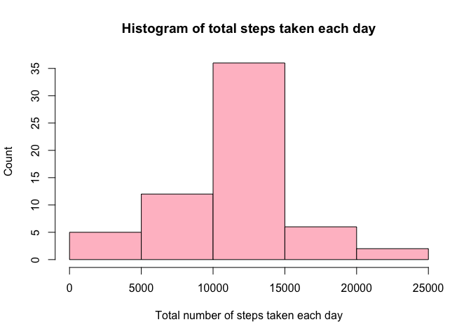
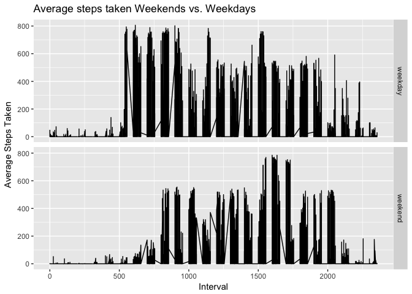

## Loading and preprocessing the data

As required, we need to load into the R environment from the .csv file.  
This code assumes that the CSV file **activity.csv** exists in the current working directory, and that the assumptions about the data format are as stated in the assignment.


```r
actData <- read.csv("activity.csv", stringsAsFactors = FALSE)
actData$date <- as.Date(actData$date)
```

## What is mean total number of steps taken per day?


```r
stepsPerDay <- aggregate(steps ~ date, actData, sum)
hist(stepsPerDay$steps, xlab = "Total number of steps taken each day", ylab = "Count",
     main = "Histogram of total steps taken each day", col = "purple")
```

<!-- -->


```r
meanSteps <- mean(stepsPerDay$steps)
medSteps <- median(stepsPerDay$steps)
```

The **mean** of the total number of steps taken per day is 10766.1886792453.  
The **median** of the total number of steps taken per day is 10765.

## What is the average daily activity pattern?


```r
fiveMinInt = aggregate(steps ~ interval, actData, mean)
plot(fiveMinInt$interval, fiveMinInt$steps, type = "l", xlab = "Interval",
     ylab = "Ave Steps Taken", main = "Ave steps taken by 5-min interval")
```

<!-- -->


```r
maxStepsInterval = fiveMinInt$interval[which.max(fiveMinInt$steps)]
```

The 5-minute interval that contains the maximum number of steps is 835.

## Imputing missing values


```r
totalMissing = sum(is.na(actData$steps))
```

The total number of missing step values in the dataset is 2304.

A simple strategy I will use to fill in the missing data is to use the mean for that 5-minute interval to fill in the **NA**s.


```r
completeData <- actData

for (i in 1:nrow(completeData))
{
    if (is.na(completeData$steps[i]))
    {
        newIndex = which(completeData$interval[i] == fiveMinInt$interval)
        completeData$steps[i] <- fiveMinInt[newIndex, ]$steps
    }
}

complAveSteps <- aggregate(steps ~ date, completeData, sum)
hist(complAveSteps$steps, xlab = "Total number of steps taken each day", ylab = "Count",
     main = "Histogram of total steps taken each day", col = "pink")
```

<!-- -->


```r
newMeanSteps <- mean(complAveSteps$steps)
newMedSteps <- median(complAveSteps$steps)
```

The **new mean** of the total number of steps taken per day is 10766.1886792453.  
The **new median** of the total number of steps taken per day is 10766.1886792453.

The mean is unchanged from the orginal data.  Using the the means of the 5-minute intervals results in a slightly higher median, as the data has shifted slightly. 


## Are there differences in activity patterns between weekdays and weekends?


```r
# create a new factor variable in the dataset with two levels – “weekday” and “weekend”
completeData$weekday <- weekdays(completeData$date)
completeData$dayType[!(completeData$weekday %in% c("Saturday", "Sunday"))] <- "weekday"
completeData$dayType[completeData$weekday %in% c("Saturday", "Sunday")] <- "weekend"

fiveMinAgg <- aggregate(steps ~ ., completeData, mean)
 
library(ggplot2)
qplot(interval, steps,  data = fiveMinAgg, geom = "line", xlab = "Interval",
      facets = dayType ~ .,
      ylab = "Average Steps Taken",
      main = "Average steps taken Weekends vs. Weekdays")
```

<!-- -->


